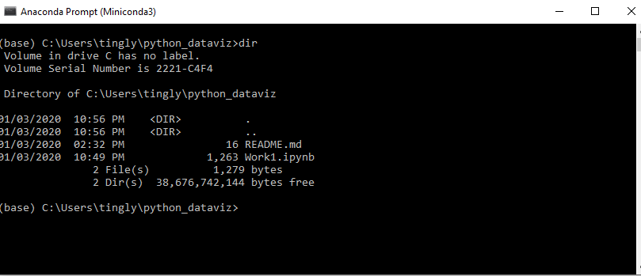

# python_dataviz
นางสาวกัญญ์รินท์ อินทจันทร์ 603021854-4 สาขาสารสนเทศสถิติ

# 1.Python
ขั้นตอนที่ 1 ทำการดาวน์โหลด miniconda python 3.7 ที่เว็บนี้ [การดาวน์โหลด Python](https://docs.conda.io/en/latest/miniconda.html) โดยเลือกขนาด bit ตามเครื่องคอมพิวเตอร์ของตนเอง แล้วคลิกดาวน์โหลด แล้วรันโปรแกรมจนเสร็จสิ้นการดาวน์โหลด

ขั้นตอนที่ 2 ค้นหาโปรแกรมที่ Search Box ข้าง Icon Windows จากนั้นพิมพ์ Anaconda Prompt แล้วเปิดโปรแกรมจะได้ดังรูป

ขั้นตอนที่ 3 ทำการ Install matplotlib โดยใช้คำสั่ง conda install matplotlib และกด enter จะได้ดังนี้

ขั้นตอนที่ 4 ทำการ Install jupyter โดยใช้คำสั่ง conda install jupyter และกด enter จะได้ดังนี้

# 2.Colab
ขั้นตอนที่ 1 เข้าไปที่ [colab](https://colab.research.google.com/notebooks/welcome.ipynb#recent=true) เพื่อลงชื่อเข้าใช้ โดยจะใส่เป็น gmail หรือ kkumail ของมหาวิทยาลัยก็ได้ จะได้ดังรูป

ขั้นตอนที่ 2 เมื่อจะทำการเขียนโค้ด คลิกที่ File > New Python3 Notebook ถ้าต้องการเปลี่ยนชื่อไฟล์ให้คลิกที่มุมบนทางซ้าย ในที่นี้คือ Work1.ipynb และคลิกที่ File > Downlond.ipynb เพื่อดาวน์โหลดลงเครื่องคอมพิวเตอร์ไปเก็บไว้ยังโฟลเดอร์ที่เราต้องการดังรูป

# 3.GitHub
ขั้นตอนที่ 1 ค้นหา GitHub บนอินเทอร์เน็ตหรือ [GitHub](https://github.com/) จากนั้นทำการสมัครใช้งานโดยกด sign up และกรอกข้อมูลให้ครบถ้วนโดยเลือกสมัครแบบ public หรือ Private แต่ถ้าหากมีบัญชีผู้ใช้งานอยู่แล้วให้ทำการ login เข้าใช้งานได้เลย

ขั้นตอนที่ 2 เมื่อทำการสมัครเสร็จเรียบร้อยแล้ว คลิกที่ + มุมขวาด้านบน และเลือก New repository > ตั้งชื่องาน >เลือกคำตอบเพื่อตอบคำถาม > Create repository (เพื่อสร้างที่เก็บงาน)

ขั้นตอนที่ 3 คลิกที่ Clone or Download และ copy URL ดังรูป [Example](https://github.com/Kanyarin/Work1)

ขั้นตอนที่ 4 ทำการ Install git โดยใช้คำสั่ง conda install -c anaconda git จะได้ดังรูป

ขั้นตอนที่ 5 ทำการ Clone git โดยใช้คำสั่ง git clone ตามด้วย URL ที่ copy มา ดังรูป

ขั้นตอนที่ 6 ใช้คำสั่ง dir เพื่อดูว่ามีโฟลเดอร์หรือเปล่า

ขั้นตอนที่ 7 ใช้คำสั่ง git status เพื่อตรวจสอบไฟล์ที่ยังไม่เชื่อมต่อ Internet

ขั้นตอนที่ 8 ใช้คำสั่ง git add เพื่อ add ไฟล์ที่ต้องการลง Internet

ขั้นตอนที่ 9 ใช้คำสั่ง git commit -m “test git”

ขั้นตอนที่ 10 ใช้คำสั่ง git put เพื่อ upload file เข้าไปใน website โดยทำการกรอก username และ password ทุกครั้ง

# การใช้ Visual Studio Code
ขั้นตอนที่ 1 ค้นหา Visual Studio Code บนอินเทอร์เน็ต หรือคลิก [Visual Studio Code](https://code.visualstudio.com/)

ขั้นตอนที่ 2 เปิดใช้งานโปรแกรม Visual Studio Code ผ่าน Anaconda ใช้คำสั่ง cd "address ที่เราใช้เก็บไฟล์งาน" > enter

ขั้นตอนที่ 3 ใช้คำสั่ง code . เพื่อเปิด Visual Studio Code

